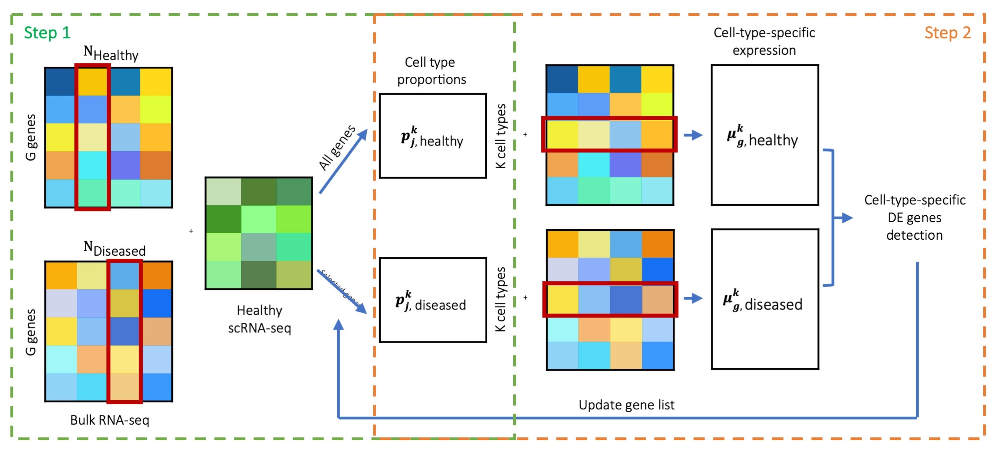

%\VignetteEngine{knitr::rmarkdown}
---
title: "MuSiC2: cell type deconvolution for multi-condition bulk RNA-seq data"
author: 
  - name: Jiaxin Fan (jiaxinf@pennmedicine.upenn.edu)
    
output: 
   html_document:
      number_sections: FALSE
      self_contained: yes
      toc: yes
---

```{r, echo=FALSE, message=FALSE}
library(knitr)
# install devtools if necessary
if (!"devtools" %in% rownames(installed.packages())) {
  install.packages('devtools')
}
# install MuSiC package
if (!"MuSiC2" %in% rownames(installed.packages())) {
  devtools::install_github('xuranw/MuSiC')
}
library(MuSiC)
library(ggplot2)
library(xbioc)
library(dplyr)
library(gridExtra)
library(grid)
```

# Introduction
________________

This vignette provides a walk through tutorial on how to use MuSiC2 to estimate cell type proportions for bulk RNA-seq data using scRNA-seq data as reference when the bulk and scRNA-seq data are generated from samples with multiple clinical conditions.

## Installation

```{r intallation, message=FALSE}
# install devtools if necessary
if (!"devtools" %in% rownames(installed.packages())) {
  install.packages('devtools')
}
# install the MuSiC2 package
if (!"MuSiC2" %in% rownames(installed.packages())) {
  devtools::install_github('Jiaxin-Fan/MuSiC2')
}
# load
library(MuSiC2)
```

## Data

Similar as MuSiC (Wang *et al*., 2019), MuSiC2 uses two types of input data:

* Bulk RNA sequencing expression data collected from samples with 2 different clincial conditions, e.g., healthy and diseased. These are the data we want to deconvolve.

* Single-cell RNA sequencing (scRNA-seq) expression data collected from samples with single condition, e.g., healthy. The cell types of scRNA-seq are pre-determined. These serve as the reference for estimating cell type proportions of the bulk data.

Both datasets should be in the form of `ExpressionSet`. The details of constructing `ExpressionSet` can be found on [this page](https://www.bioconductor.org/packages/release/bioc/vignettes/Biobase/inst/doc/ExpressionSetIntroduction.pdf).

# MuSiC2 Deconvolution
___________________

MuSiC2 is an iterative algorithm aiming to improve cell type deconvolution for bulk RNA-seq data when the bulk data and scRNA-seq reference are generated from samples with different clinical conditions. The key idea of MuSiC2 is that, when the bulk samples and single-cell samples are from different clinical conditions, the majority of genes shall still have similar cell-type-specific gene expression pattern between conditions. By removing genes with cell-type-specific differential expression (DE) between conditions from the single-cell reference, MuSiC2 can refine the reference gene list and yield more accurate cell type proportion estimates. 

Assuming we want to deconvolve bulk RNA-seq samples generated from both Healthy and Diseased conditions, using scRNA-seq data generated only from the Healthy condition as the reference. MuSiC2 iterates over 2 steps. In Step 1, we use MuSiC (Wang *et al*. 2019) to infer the cell type proportions of the bulk samples under both conditions by borrowing information from the scRNA-seq data. In Step 2, for samples within each condition, we deconvolve the bulk-level expression over the cell type proportion estimates obtained in Step 1 to infer the cell-type-specific mean expression for each gene and identify cell-type-specific DE genes between conditions. Then, by removing genes with cell-type-specific DE from the scRNA-seq data, we can update the cell type proportion estimates in Step 1 for bulk samples generated under Diseased condition. By alternating between cell type deconvolution (Step 1) and cell-type-specific DE gene detection and removal (Step 2), MuSiC2 gradually refines the list of “stable” genes retained in the scRNA-seq reference and improves the cell type proportion estimation for the diseased samples. An overview of MuSiC2 is shown in Figure 1.

<style>
figure{
  text-align: center;
}
</style>

<figure>
<p align="center"> 
{width="90%"}
<figcaption> Figure 1: Overview of MuSiC2 </figcaption>
</p>
</figure>

To test for the cell-type-specific DE genes, a resampling procedure is employed in order to achieve a reliable estimate. Specifically, at each resampling iteration, we generate a subset of samples by random sampling without replacement under each clinical condition, and compute the log fold change of cell-type-specific expression between conditions, $logFC_g^k=\frac{\mu_{g, diseased}^k}{\mu_{g, healthy}^k}$. We define a statistic $T_g^k$ as the absolute value of the ratio of the mean and standard deviation (SD) of the $logFC_g^k$ over all resamples as a measure of the cell-type-specific DE. Genes with $T_g^k$ in the top 5% for common cell types, i.e., cell types with average proportion ≥ 10%, or in the top 1% for rare cell types, i.e., cell types with average proportion < 10%, are considered as cell-type-specific DE genes. Since fold change is sensitive to genes with low expression, we suggest that genes with bulk-level average sequencing depth < 20 are retained as "stable" genes and excluded from the cell-type-specific DE detection. We further filter the genes by their expression levels in the random samples. Specifically, we compute the mean of $\mu_{g,healthy}^k$ and $\mu_{g,diseased}^k$ over the resamples, and retain genes with cell-type-specific expression in the bottom 5% for samples in both conditions as "stable" genes and exclude them from the cell-type-specific DE detection. See the Methods session of the MuSiC2 manuscript for additional details.

# Sample Analysis
___________________

For illustration purpose, in this tutorial, we deconvolved the benchmark bulk RNA-seq data, which contain raw RNA-seq read counts and sample annotation data for 100 healthy and 100 diseased (i.e., Type 2 diabetes (T2D)) samples simulated based on pancreatic islets scRNA-seq RNA-seq data from Segerstolpe *et al*. (2016). The procedure for generating the benchmark dataset can be found in the Methods session of the MuSiC2 manuscript. We deconvolved the benchmark bulk RNA-seq data using scRNA-seq data generated from 6 healthy subjects by Segerstolpe *et al*. (2016). Both datasets can be found on [this page](https://jiaxin-fan.github.io/MuSiC2/pages/data.html).

```{r read_data}
## Bulk RNA-seq data
benchmark.eset = readRDS("./data/bulk-eset.rds")
benchmark.eset
# clinical conditions
table(benchmark.eset$group)

## scRNA-seq data
seger.eset = readRDS("./data/single-eset.rds")
seger.eset
```

## Cell Type Deconvolution

The cell type proportions are estimated by the function `music2_prop`. The essential inputs are:

* `bulk.eset`: ExpressionSet of bulk data;
* `sc.eset`: ExpressionSet of single cell data;
* `condition`: character, the phenoData of bulk dataset used for indicating clinical conditions;
* `control`: character, the clinical condition of bulk samples that is the same as the clinical condition of the single cell samples;
* `case`: character, the clinical condition of bulk samples that is different from the clinical condition of the single cell samples;
* `clusters`: character, the phenoData from single cell dataset used as clusters;
* `samples`: character, the phenoData from single cell dataset used as samples;
* `select.ct`: vector of cell types. Default is `NULL`, which uses all cell types provided in the single-cell data;
* `n_resample`: numeric, number of resamples used for detecting cell-type-specific DE genes. Default is 20;
* `sample_prop`: numeric, proportion of samples to be randomly sampled without replacement under each clinical condition for each resample. Default is 0.5;
* `cutoff_c`: numeric, cutoff on the upper quantile of $T_g^k$ statistics for detecting cell-type-specific DE genes for common cell types (i.e., cell type proportion $\ge$ 0.1). Default is 0.05;
* `cutoff_r`: numeric, cutoff on the upper quantile of $T_g^k$ statistics for detecting cell-type-specific DE genes for rare cell types (i.e., cell type proportion < 0.1). Default is 0.01;

The output of `music2_prop` is a list with elements:

* `Est.prop`: matrix, cell type proportion estimates;
* `convergence`: logical, whether MuSiC2 converged or not;
* `n.iter`: numeric, number of iterations;
* `DE.genes`: vector, cell-type-specific DE genes being removed;

For illustration purpose, we constrained our analysis on 6 well-studied cell types: acinar, alpha, beta, delta, ductal and gamma. Figure 2 below showed the estimated cell type proportion of MuSiC2 separated by disease status (e.g., healthy and T2D).

```{r cell_type_deconvolution}
# music2 deconvolution
set.seed(1234)
est.prop = music2_prop(bulk.eset = benchmark.eset, sc.eset = seger.eset, condition='group', control='healthy',case='t2d', clusters = 'cellType', samples = 'sampleID', select.ct = c('acinar','alpha','beta','delta','ductal','gamma'), n_resample=20, sample_prop=0.5,cutoff_c=0.05,cutoff_r=0.01)$Est.prop
```

```{r cell_type_deconvolution_1, echo=FALSE, fig.height=3, fig.width=6, fig.align='center',fig.cap="Figure 2: Cell Type Composition. Jitter plots showing estimated cell type proportions of benchmark bulk RNA-seq samples by disease status (healthy and T2D), estimated using MuSiC2 with healthy scRNA-seq data as reference. The medians of cell type proportions across samples is showed by the black horizontal lines."}
# plot estimated cell type proportions
prop_all = cbind('proportion'=c(est.prop), 'sampleID'=rep(rownames(est.prop),times=ncol(est.prop)), 'celltype'=rep(colnames(est.prop), each=nrow(est.prop)))
prop_all = as.data.frame(prop_all)
prop_all$proportion = as.numeric(as.character(prop_all$proportion))
prop_all$group = ifelse(prop_all$sampleID %in% seq(from=1, to=100, by=1), 'Healthy', 'T2D')
cols <-c("alpha" = "cadetblue2", "beta" = "lightsalmon1", "delta" = "palegreen2", "ductal" = "goldenrod1",
          "gamma"="steelblue3", "acinar" = "plum2")
ggplot(prop_all, aes(x=celltype, y=proportion, color=celltype)) + xlab('')+
  geom_jitter(width=0.25,alpha=0.8)+ylab('Cell Type Proportions')+theme_bw()+
  stat_summary(fun = median,
               geom = "crossbar", width = 0.5,size=0.5,color='gray36')+
  facet_grid(.~group)+
  theme(plot.title = element_text(hjust = 0.5, size=12),
        axis.text.x = element_text(size=12,angle = 45,hjust=1),
        axis.text.y = element_text(size=12),
        axis.title.x = element_text(size=12),
        axis.title.y = element_text(size=12),
        axis.line = element_line(colour = "black"),
        strip.text.x = element_text(size = 12),
        panel.grid.major = element_blank(),
        panel.grid.minor = element_blank(),
        panel.border = element_blank(),
        panel.background = element_blank(),
        legend.position = 'none')+
  scale_color_manual(values=cols)
```

We also deconvolved the benchmark bulk RNA-seq data using MuSiC (Wang *et al*., 2019), and evaluated the accuracy of both deconvolution methods by comparing the estimated cell type proportions obtained by MuSiC2 and by MuSiC to the true proportions. Below we present the individual-level root mean square error (RMSE) across cell types for the two deconvolution methods separated by disease status (e.g., healthy and T2D) (Figure 3: left). As expected, because MuSiC2 only refines the gene list in the single cell reference when deconvolving bulk samples generated from clinical condition that differs from the single cell data, MuSiC and MuSiC2 had exactly the same performance for healthy samples with estimation bias close to 0. For diseased samples, MuSiC2 improved the estimation accuracy, highlighting the significance of gene selection for deconvolution. Especially for beta cells, MuSiC2 produced much more accurate cell type proportion estimates for diseased bulk samples than MuSiC, which suffered from severe underestimation (Figure 3: right).

```{r compare, echo=FALSE, fig.height=3, fig.width=7, fig.align='center', message=FALSE, fig.cap="Figure 3: Estimation Accuracy. We evaluated the performance of MuSiC2 and compared to MuSiC using the benchmark bulk RNA-seq samples with healthy scRNA-seq data as reference. (Left) Boxplots of individual-level root mean square error (RMSE) across cell types separated by disease status (healthy and T2D). (Right) Boxplots of beta cell proportions comparing true proportions with estimated proportions by MuSiC2 and by MuSiC, separated by disease status (healthy and T2D)."}
ALL=cbind(prop_all[,-4],'Method'='MuSiC2')
# MuSiC
prop_music=music_prop(bulk.eset = benchmark.eset, sc.eset = seger.eset, 
                      clusters = 'cellType', samples = 'sampleID', 
                      select.ct = c('acinar','alpha', 'beta', 'delta', 'ductal','gamma'), 
                      verbose = F)$Est.prop.weighted
prop_all = cbind('proportion'=c(prop_music),'celltype'=rep(colnames(prop_music), each=nrow(prop_music)), 'sampleID'=rep(rownames(prop_music),times=ncol(prop_music)),'Method'='MuSiC')
prop_all=as.data.frame(prop_all)
prop_all$proportion=as.numeric(as.character(prop_all$proportion))
ALL=rbind(ALL,prop_all)

# true proportion
load('./data/true_proportion.RData')
prop_all=cbind(prop_all,'Method'='Truth')
ALL=rbind(ALL,prop_all)
ALL$group = ifelse(ALL$sampleID %in% seq(from=1, to=100, by=1), 'Healthy', 'T2D')
ALL$Method = factor(ALL$Method, levels=c('Truth','MuSiC2','MuSiC'))

# root mean square error
RMSE <- function(proportion.x, proportion.y){
  sqrt(mean((proportion.x-proportion.y)^2))}
prop_bias = merge(ALL[ALL$Method %in% c('MuSiC','MuSiC2'),], ALL[ALL$Method=='Truth',-4], by=c('sampleID','celltype','group'))
bias = prop_bias %>% dplyr::group_by(Method, sampleID, group) %>% dplyr::summarise(rmse=RMSE(proportion.x, proportion.y))
p1=ggplot(bias, aes(x=Method, y=rmse, fill=group)) + geom_boxplot()+
  ylab('RMSE')+xlab('')+theme_bw()+
  theme(axis.text.x = element_text(size=12),
        axis.text.y = element_text(size=12),
        axis.title.x = element_text(size=12),
        axis.title.y = element_text(size=12),
        axis.line = element_line(colour = "black"),
        strip.text.x = element_text(size = 12),
        panel.grid.major = element_blank(),
        panel.grid.minor = element_blank(),
        panel.border = element_blank(),
        panel.background = element_blank(),
        legend.position = 'none',
        legend.title = element_blank())

# beta cell
p2=ggplot(ALL[ALL$celltype=='beta',], aes(x=Method, y=proportion, fill=group)) + geom_boxplot()+
  ylab('Beta Cell Proportions')+xlab('')+theme_bw()+
  theme(axis.text.x = element_text(size=12),
        axis.text.y = element_text(size=12),
        axis.title.x = element_text(size=12),
        axis.title.y = element_text(size=12),
        axis.line = element_line(colour = "black"),
        strip.text.x = element_text(size = 12),
        panel.grid.major = element_blank(),
        panel.grid.minor = element_blank(),
        panel.border = element_blank(),
        panel.background = element_blank(),
        legend.position = 'right',
        legend.title = element_blank())

grid.arrange(p1,p2,widths=c(3,4))
```

# Reference
________________
Wang, X., Park, J., Susztak, K., Zhang, N.R., and Li, M. 2019. “Bulk Tissue Cell Type Deconvolution with Multi-Subject Single-Cell Expression Reference.” *Nature Communications* 10: 380.

Segerstolpe, Å., Palasantza, A., Eliasson, P., Andersson, E.M., Andréasson, A.C., et al. 2016. "Single-cell Transcriptome Profiling of Human Pancreatic Islets in Health and Type 2 Diabetes." *Cell metabolism*. 24: 593-607.

